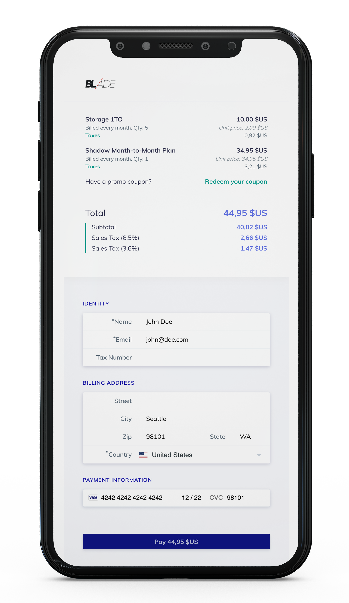

# [Beanie](https://www.octobat.com/products/beanie)

Beanie is a tool that makes you able to integrating Stripe easily with the [SCA compliance requirements](https://stripe.com/en-fr/guides/strong-customer-authentication). We’ve added our sales tax (VAT, GST, Sales Tax) calculation layer on top. So, if you need to collect payments quickly without struggling with Stripe API calls and tax management, you may have to need Beanie.

**You can see a demo of Beanie running in test mode on [the Octobat website](https://octobat.com/products/beanie).**

**Check our roadmap on the Github project tab above :point_up: or directly [here](https://github.com/0ctobat/octobat-beanie.js/projects/1).**

## Overview

|     | Features
:---: | :---
✨ | **Beautiful UI components for card payments.** Beanie uses pre-built Stripe components customized to fit the app design, including the [Card Element](https://stripe.com/docs/elements) which provides real-time validation, formatting, and autofill.
:white_check_mark: | **VAT number validation for European Union businesses.** The Tax Number field checks the validity of a VAT number thanks to the [VIES API](http://ec.europa.eu/taxation_customs/vies/).
🎩 | **Automatic sales tax (VAT/GST/Sales Tax) calculation.** Picking a country will automatically have an impact on the tax rate(s) of the transaction. The billing country as the state (for the US only) is one of multiple evidences to calculate the correct tax rate.
🔐 | **Dynamic 3D Secure for Visa and Mastercard.** The app automatically handles the correct flow to complete card payments with [3D Secure](https://stripe.com/docs/payments/dynamic-3ds), whether it’s required by the card or encoded in one of your [3D Secure Radar rules](https://dashboard.stripe.com/radar/rules).
📱 | **Responsive design**. The Beanie experience works on all screen sizes.
📦 | **No datastore required.** Products, and SKUs are stored using the [Stripe API](https://stripe.com/docs/api/products) or the [Stripe Dashboard](https://dashboard.stripe.com/products) directly.
:bookmark: | **Coupons management.** Beanie handles coupons for Stripe SKUs. This feature is accessible from the [Octobat Configuration Dashboard](https://app.octobat.com/configuration/coupons). Beanie uses Stripe coupons as well.

## Documentation

- [Beanie Client Quickstart](https://www.octobat.com/developers/beanie-client)

## Support

If you encounter any problems or bugs, please open an issue on [GitHub](https://github.com/0ctobat/octobat-beanie.js/issues).

Need help setting up or want to customize this extension to meet your business needs? Please email support@octobat.com and if we like your idea we will add this feature on our [roadmap](https://github.com/0ctobat/octobat-beanie.js/projects/1).
